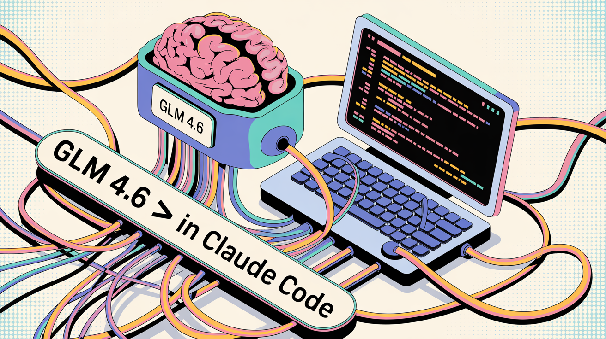

# Claude Sonnet ↔ GLM-4.6 Switching Tutorial Companion



> 📹 **Companion Guide for Video Tutorial**
> Follow along step-by-step with the commands and configurations shown in the video.

## 🎯 What This Setup Accomplishes

- ✅ Switch between Claude Sonnet and GLM-4.6 in seconds
- ✅ Maintain separate configurations for each model
- ✅ Install and configure Z.AI MCP server for enhanced capabilities
- ✅ Backup and restore settings safely
- ✅ Quick aliases for rapid model switching

---

## 📋 Prerequisites

Before starting, make sure you have:
- Claude Code installed
- Z.AI API key (get from [z.ai](https://z.ai))
- Terminal access (bash shell)
- Basic familiarity with command line

---

## 🚀 Step-by-Step Installation

### Step 1: Create Profile Directory Structure

```bash
# Create directories for both model profiles
mkdir -p ~/.claude/profiles/claude
mkdir -p ~/.claude/profiles/glm
```

### Step 2: Backup Your Current Settings

```bash
# Backup existing Claude Code settings
cp ~/.claude/settings.json ~/.claude/profiles/claude/settings.json
```

### Step 3: Create GLM-4.6 Profile Configuration

```bash
cat > ~/.claude/profiles/glm/settings.json << 'EOF'
{
  "$schema": "https://json.schemastore.org/claude-code-settings.json",
  "alwaysThinkingEnabled": true,
  "feedbackSurveyState": {
    "lastShownTime": 1754086805065
  },
  "env": {
    "ANTHROPIC_BASE_URL": "https://api.z.ai/api/anthropic",
    "ANTHROPIC_AUTH_TOKEN": "your-z-ai-api-key"
  },
  "models": {
    "default": "glm-4.6",
    "fast": "glm-4.5-air",
    "smart": "glm-4.6"
  }
}
EOF
```

**🔑 IMPORTANT**: Replace `"your-z-ai-api-key"` with your actual Z.AI API key!

### Step 4: Create Claude Sonnet Profile Configuration

```bash
cat > ~/.claude/profiles/claude/settings.json << 'EOF'
{
  "$schema": "https://json.schemastore.org/claude-code-settings.json",
  "alwaysThinkingEnabled": true,
  "feedbackSurveyState": {
    "lastShownTime": 1754086805065
  },
  "models": {
    "default": "claude-sonnet-4-5-20241022",
    "fast": "claude-sonnet-4-5-20241022",
    "smart": "claude-sonnet-4-5-20241022"
  }
}
EOF
```

### Step 5: Create the Profile Switcher Script

```bash
# Create the switcher script file
nano ~/.claude/switch-profile.sh
```

**Paste this complete script into the editor:**

```bash
#!/bin/bash

PROFILE=$1
CLAUDE_DIR="$HOME/.claude"
PROFILES_DIR="$CLAUDE_DIR/profiles"

if [ -z "$PROFILE" ]; then
    echo "Usage: source $0 [claude|glm]"
    echo "Current profiles:"
    ls -1 "$PROFILES_DIR" 2>/dev/null || echo "No profiles found"
    return 1 2>/dev/null || exit 1
fi

if [ ! -d "$PROFILES_DIR/$PROFILE" ]; then
    echo "Profile '$PROFILE' not found"
    return 1 2>/dev/null || exit 1
fi

# Always backup current settings
if [ -f "$CLAUDE_DIR/settings.json" ]; then
    cp "$CLAUDE_DIR/settings.json" "$CLAUDE_DIR/settings.json.backup"
fi

# Switch to requested profile
cp "$PROFILES_DIR/$PROFILE/settings.json" "$CLAUDE_DIR/settings.json"

# Handle environment variables properly
if [ "$PROFILE" = "glm" ]; then
    API_KEY=$(grep "ANTHROPIC_AUTH_TOKEN" "$CLAUDE_DIR/settings.json" | cut -d'"' -f4)
    export ANTHROPIC_BASE_URL="https://api.z.ai/api/anthropic"
    export ANTHROPIC_AUTH_TOKEN="$API_KEY"
    echo "Switched to GLM 4.6 profile"
    echo "Environment variables set for this session"
    echo "Current model will be: glm-4.6"
elif [ "$PROFILE" = "claude" ]; then
    # Completely remove environment variables
    unset ANTHROPIC_BASE_URL 2>/dev/null || true
    unset ANTHROPIC_AUTH_TOKEN 2>/dev/null || true

    # Also remove from current environment explicitly
    export ANTHROPIC_BASE_URL=""
    export ANTHROPIC_AUTH_TOKEN=""
    unset ANTHROPIC_BASE_URL
    unset ANTHROPIC_AUTH_TOKEN

    echo "Switched to Claude Sonnet profile"
    echo "Environment variables cleared"
    echo "Current model will be: claude-sonnet-4-5-20241022"
    echo "You may need to run /login if session expired"
fi

echo "Active profile: $PROFILE"
echo "Restart Claude Code to ensure clean switch: claude"
```

Save and exit:
- Press `Ctrl+X`
- Press `Y` to confirm
- Press `Enter` to save

Make the script executable:
```bash
chmod +x ~/.claude/switch-profile.sh
```

### Step 6: Add Quick Switch Aliases

```bash
# Add convenient aliases to your bash configuration
echo '' >> ~/.bashrc
echo '# Claude Code Profile Switcher' >> ~/.bashrc
echo 'alias claude-glm="source ~/.claude/switch-profile.sh glm && echo \"GLM environment set - restart claude\""' >> ~/.bashrc
echo 'alias claude-sonnet="source ~/.claude/switch-profile.sh claude && echo \"Claude environment set - restart claude\""' >> ~/.bashrc
echo 'alias claude-status="echo \"Base URL: \$ANTHROPIC_BASE_URL\" && echo \"Token set: \$([ -n \"\$ANTHROPIC_AUTH_TOKEN\" ] && echo yes || echo no)\""' >> ~/.bashrc

# Reload bash configuration
source ~/.bashrc
```

### Step 7: Install Z.AI MCP Server

```bash
# Install the Z.AI MCP server for Claude Code
claude mcp add zai-mcp-server --scope user --transport stdio --env Z_AI_API_KEY=YOUR-API-KEY --env Z_AI_MODE=ZAI -- npx -y @z_ai/mcp-server
```

**🔑 IMPORTANT**: Replace `YOUR-API-KEY` with your actual Z.AI API key!

This will add configuration like this to your Claude MCP settings:
```json
"zai-mcp-server": {
  "type": "stdio",
  "command": "npx",
  "args": [
    "-y",
    "@z_ai/mcp-server"
  ],
  "env": {
    "Z_AI_API_KEY": "your-actual-api-key-here",
    "Z_AI_MODE": "ZAI"
  }
}
```

---

## 🎮 How to Use The Setup

### Switching Between Models

**To switch to GLM-4.6:**
```bash
# Using the quick alias
claude-glm
claude

# Or using the script directly
source ~/.claude/switch-profile.sh glm
claude
```

**To switch to Claude Sonnet:**
```bash
# Using the quick alias
claude-sonnet
claude

# Or using the script directly
source ~/.claude/switch-profile.sh claude
claude
```

### Checking Your Current Status

```bash
# Check environment variables
claude-status

# Or manually
echo $ANTHROPIC_BASE_URL
echo $ANTHROPIC_AUTH_TOKEN
```

### Inside Claude Code

Once you're in Claude Code, you can verify:

```bash
/status          # Shows your current model
/model glm-4.6   # Manually switch to GLM-4.6 if needed
/model claude-sonnet-4-5-20241022  # Switch back to Claude
```

---

## ✅ Verification Checkpoints

### After Each Major Step, Verify:

**✅ Step 1-2 (Directory Setup):**
```bash
ls -la ~/.claude/profiles/
# Should show: claude/ and glm/ directories
```

**✅ Step 3-4 (Profile Creation):**
```bash
cat ~/.claude/profiles/glm/settings.json | grep "glm-4.6"
# Should show the GLM-4.6 configuration
```

**✅ Step 5 (Switcher Script):**
```bash
ls -la ~/.claude/switch-profile.sh
# Should show the script with executable permissions
```

**✅ Step 6 (Aliases):**
```bash
alias | grep claude
# Should show: claude-glm, claude-sonnet, claude-status
```

**✅ Step 7 (MCP Server):**
```bash
claude mcp list
# Should show zai-mcp-server in the list
```

**✅ Final Test:**
```bash
# Test switching to GLM
claude-glm
claude-status

# Test switching to Claude
claude-sonnet
claude-status
```

---

## 🔧 Troubleshooting Guide

### Common Issues & Solutions

**Issue: "Permission denied" when running switch script**
```bash
# Fix: Make it executable
chmod +x ~/.claude/switch-profile.sh
```

**Issue: "Profile not found" error**
```bash
# Check if profiles exist
ls -la ~/.claude/profiles/
# Recreate missing profiles if needed
```

**Issue: Environment variables not changing**
```bash
# Remember to always use 'source' command
source ~/.claude/switch-profile.sh glm  # NOT ./switch-profile.sh glm
```

**Issue: Model not switching in Claude Code**
```bash
# Always restart Claude Code after switching profiles
claude  # This restarts with new configuration
```

**Issue: MCP server not connecting**
```bash
# Verify installation
claude mcp list
# Reinstall if needed
claude mcp remove zai-mcp-server
# Then reinstall with Step 7 command
```

### Recovery Commands

**Restore original settings:**
```bash
cp ~/.claude/settings.json.backup ~/.claude/settings.json
```

**Remove MCP server:**
```bash
claude mcp remove zai-mcp-server
```

**Remove aliases (if needed):**
```bash
# Edit ~/.bashrc and remove the claude aliases
nano ~/.bashrc
# Then reload
source ~/.bashrc
```

---

## 📁 File Structure After Installation

```
~/.claude/
├── settings.json                    # Active configuration
├── settings.json.backup            # Auto-created backups
├── profiles/
│   ├── claude/
│   │   └── settings.json           # Claude Sonnet config
│   └── glm/
│       └── settings.json           # GLM-4.6 config
├── switch-profile.sh               # Switcher script
└── [mcp configuration]             # Z.AI MCP server settings
```

---

## 💡 Pro Tips

1. **Always use `source`** when running the switch script to ensure environment variables change in your current session
2. **Restart Claude Code** after switching profiles to ensure clean configuration loading
3. **Keep your API key secure** - never share it or commit it to version control
4. **Check status often** using `claude-status` to verify your current configuration
5. **Test both profiles** after setup to ensure everything works correctly

---

## 🎉 You're All Set!

After following these steps, you'll have:

- ✅ Two distinct profiles for Claude Sonnet and GLM-4.6
- ✅ Quick aliases for rapid switching (`claude-glm`, `claude-sonnet`)
- ✅ Z.AI MCP server installed and configured
- ✅ Backup system to safely restore settings
- ✅ Verification checkpoints to ensure everything works
- ✅ Troubleshooting guide for common issues

### Quick Reference Commands

```bash
# Switch models
claude-glm && claude      # Switch to GLM-4.6
claude-sonnet && claude   # Switch to Claude Sonnet

# Check status
claude-status             # Check current environment

# Inside Claude Code
/status                   # Verify active model
```

Enjoy seamlessly switching between Claude Sonnet and GLM-4.6! 🚀

---

*This companion guide is designed to follow along with your video tutorial. Users can pause at each step and copy-paste the commands directly.*

## 📺 Video Tutorial Link

[Add your video link here once it's published]

---

## 🤝 Contributing

Feel free to submit issues or enhancement requests!

## 📄 License

MIT License - feel free to share and modify